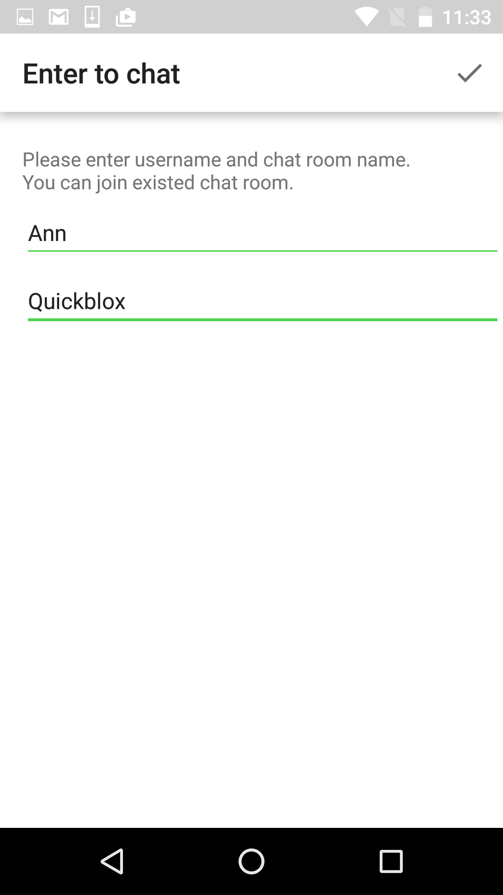
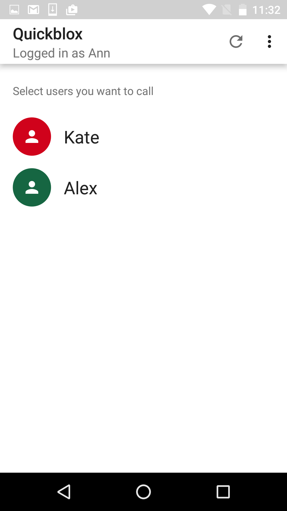
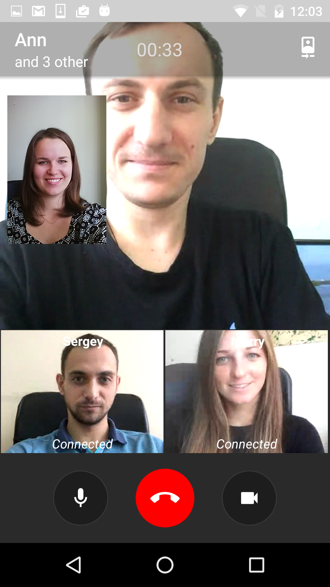
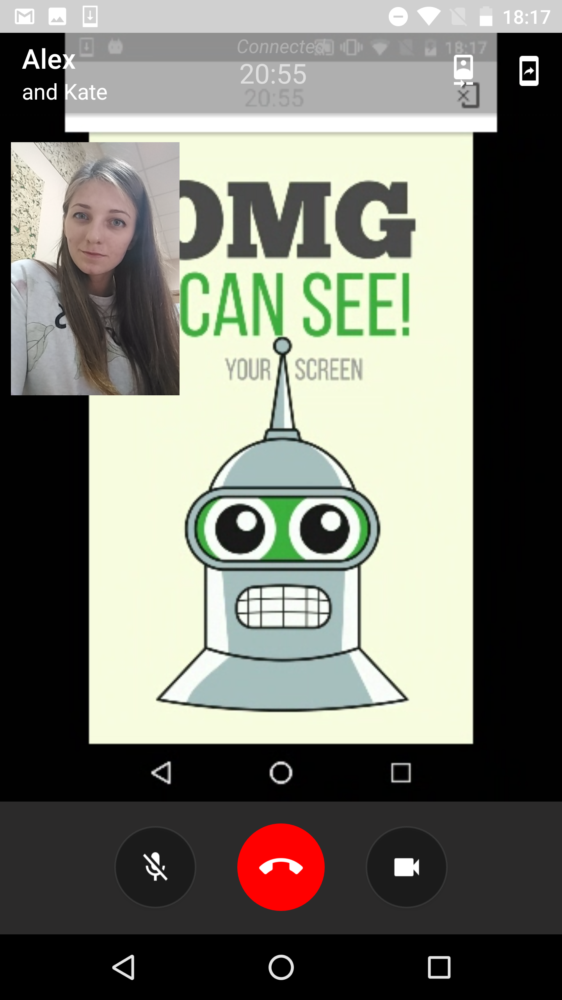

<h2> QuickBlox Android Video Group Chat WebRTC code instadate</h2>
This is a code instadate for [QuickBlox](http://quickblox.com/) platform. It is a great way for developers using QuickBlox platform to learn how to integrate WebRTC video calling features into your application.

Original instadate description & setup guide - [http://quickblox.com/developers/instadate-webrtc-android](http://quickblox.com/developers/instadate-webrtc-android)

&nbsp;&nbsp;&nbsp;&nbsp; 
&nbsp;&nbsp;&nbsp;&nbsp; 
&nbsp;&nbsp;&nbsp;&nbsp; 
&nbsp;&nbsp;&nbsp;&nbsp; 
&nbsp;&nbsp;&nbsp;&nbsp; 
